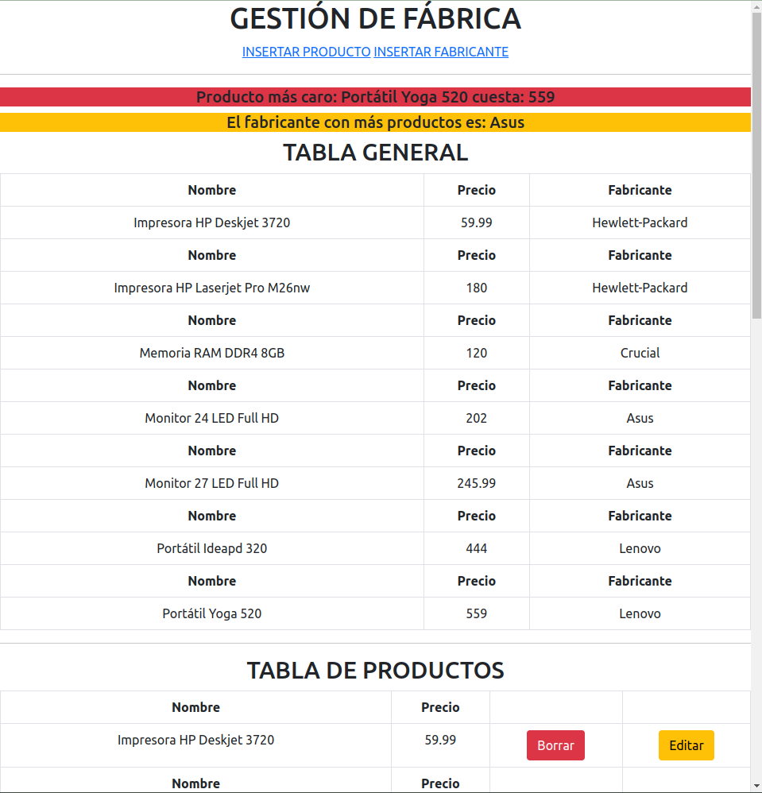

## Aplicación para gestion de productos y sus fabricantes.

App realizada completamente en php y estilos con bootstrap5

#### Pasos para desplegar la aplicación

1. Levantar el contenedor docker con el comando ```docker-compose up -d```.
2. Entrar al puerto 8081 de tu localhost para acceder a __PHPMYADMIN__. El usuario es __root__ y la contraseña __password123__.
3. Crear una base de datos que se llame __tienda__, dentro de esta base creamos las tablas __producto__ y __fabricante__. (El script está dentro de [script.sql](./www/examen2tablas/script.sql))
4. La aplicación debería funcionar accediendo a __localhost/gestionTienda/index.php__.

##### Captura de ejemplos

__Vista del index.php__ 
__Vista de insertar producto__